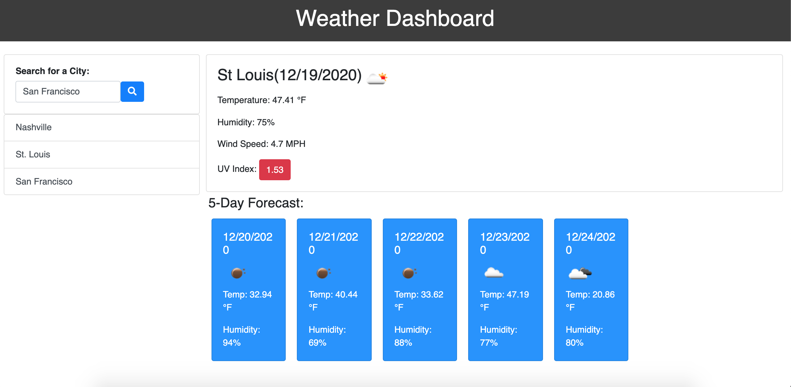

# Weather Dashboard

## Description 

This repository contains a weather dashboard that uses the OpenWeather API to retrieve weather data for cities.

The user will simply need to enter a city name in the search bar, click search, and that city's forecast will be displayed on the screen. Using 'localStorage', the app also stores any persistent data, which saves searched cities on the display even after the screen is refreshed.

Website URL: https://anniemcfarland7.github.io/Weather-Dashboard/

Repository URL: https://github.com/anniemcfarland7/Weather-Dashboard

## Screenshot 

The following image shows the web application's initial appearance:

